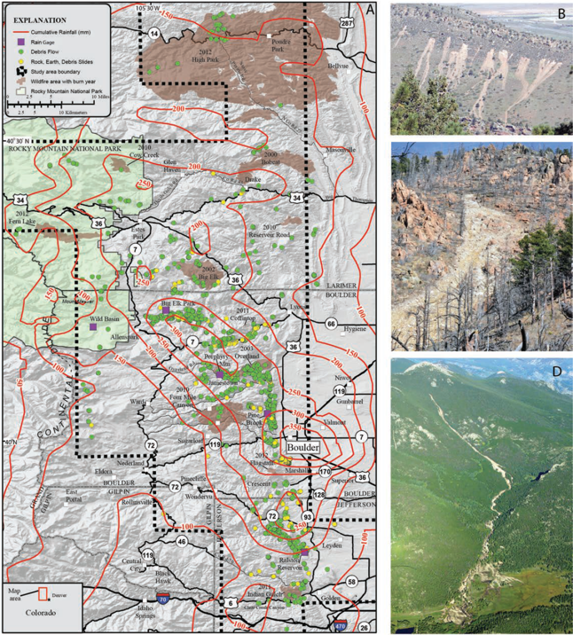

# Landslides_Prediction_SatelliteImages

# Introduction
- Rainfall from September 9 to 13, 2013 triggered at least 1138 debris flows across 3430 square kilometers of the Colorado Front Range
- Debris started with discrete sliding masses of slides, which liquefied and rapidly moved downward
 

Image source: Coe et al. (2014)
  
