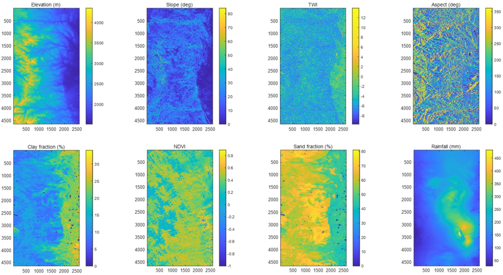

# Landslides_Prediction_SatelliteImages

# Introduction
Landslides are common disasters caused by soil mass movement defined as the movement of a mass or soils down a slope 
Heavy precipitation including rainfall and snowmelt is the most common landslide trigger

- Rainfall from September 9 to 13, 2013 triggered at least 1138 debris flows across 3430 square kilometers of the Colorado Front Range
- Debris started with discrete sliding masses of slides, which liquefied and rapidly moved downward
 

Coe et al. (2014)
  

# Data Preparation
Imput data are satellite images of the following variables
Predictor variables:
- Elevation (m)
- Slope (deg)
- Topographic Wetness Index (TWI) 
- Aspect (deg)
- Clay fraction (%)
- Sand fraction (%)
- Rainfall: cumulative rainfall from for 3 days in September

# Response variable
- Landslide label (0/1)

# Prepare the data

# Models

